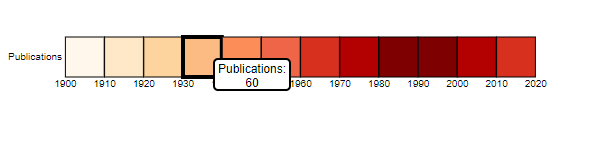

# TimeSeriesPlot

The visualization consists of a D3 View that is the representing the  time in x-coordinate and publications for an author as a color.

The plot uses a threshold value to assign colors to rectangles for bins of data. i.e. example [ 0-10 , 10-30 , 30-60 , 60-150 , 150-300 , 300-600 , 600-1500 , 1500-10000 , >10000]
constiture bins. and each should be given  a seperate color.
